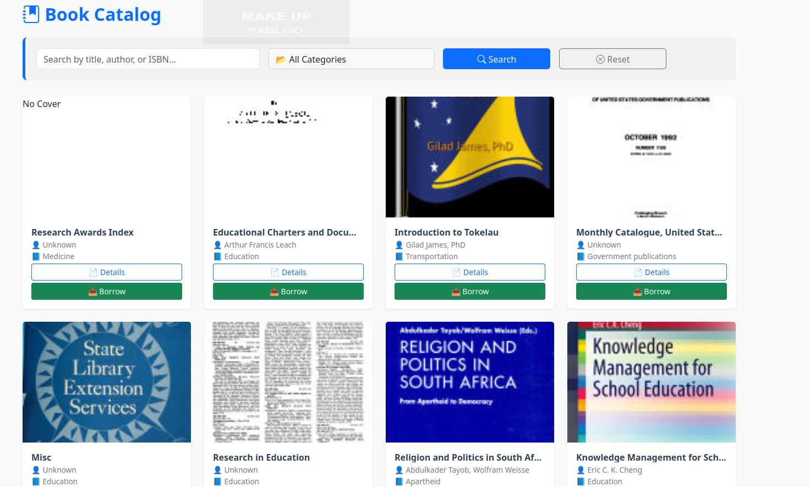
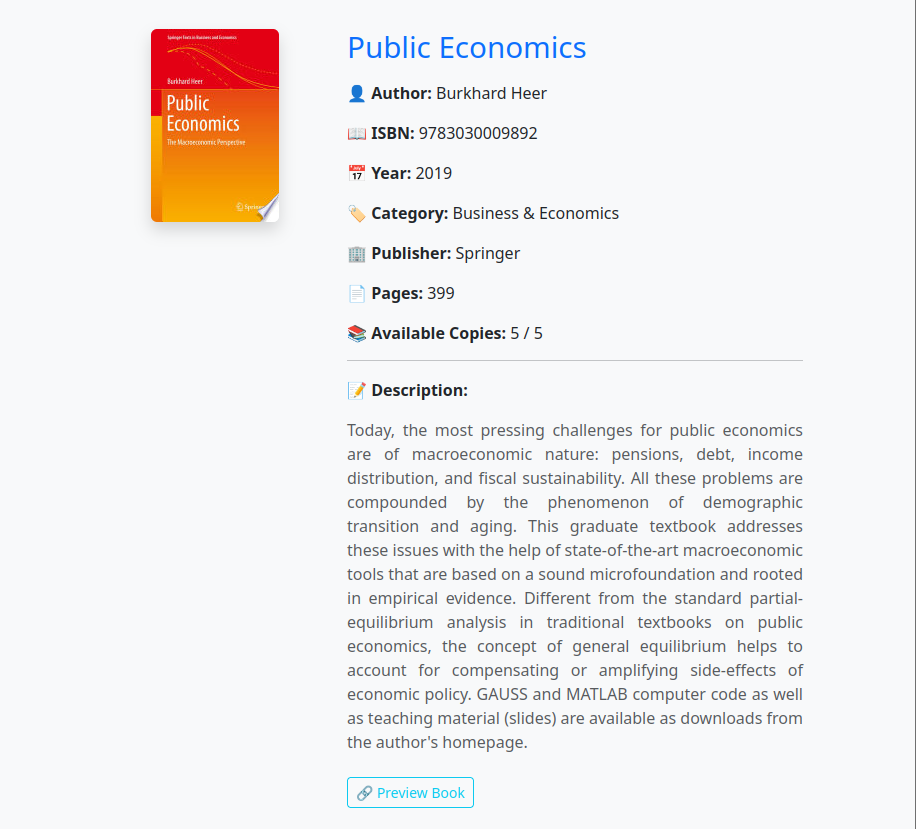
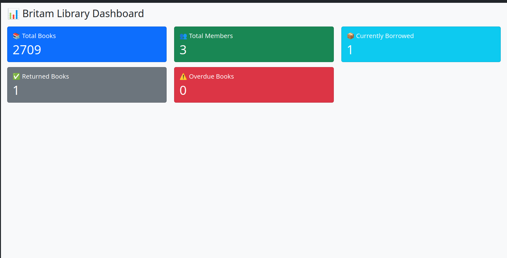
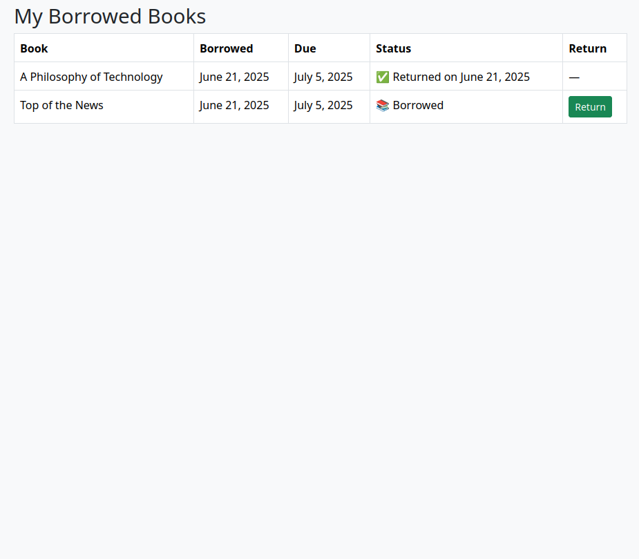

# 📚 Britam Library Management System

A full-featured Django-powered web application for managing books, member profiles, borrowing records, and admin dashboards for a digital library environment.

---

## 🚀 Key Features

- 🔐 **User Authentication** — Registration, login, logout, and user roles (Member, Staff, Admin)
- 📖 **Book Catalog** — Add books manually or via Google Books API, with cover images and metadata
- 🔍 **Search & Filter** — By title, author, ISBN, and category
- 📂 **Book Categories** — Group and manage book categories
- 📘 **Book Details Page** — View metadata, cover, description, and borrow link
- 🧾 **Borrow/Return System** — Tracks borrowing, due dates, returns, and overdue items
- 👤 **Member Dashboard** — Profile view, editing, profile picture uploads
- 📤 **Export to CSV** — Member data and borrow records exportable by admins
- 📊 **Admin Dashboard** — Real-time metrics for total books, users, borrowed and overdue books
- 🖼️ **Profile Image Support** — Upload your image or fallback to a default avatar
- 💅 **Responsive UI** — Bootstrap 5 layout with custom CSS, search UI, hover effects

---

## 📦 Requirements

| Tool / Package       | Version     |
|----------------------|-------------|
| Python               | 3.8+        |
| Django               | 5.2+        |
| Pillow               | Image upload support |
| `django-widget-tweaks` | For styling forms |
| requests             | Google Books API |

---

## 🧱 Project Structure

```plaintext
britam_library/
│
├── books/             # Book model, views, Google API import
├── members/           # Member profiles, edit, export
├── borrowing/         # Borrow/return records
├── dashboard/         # Admin dashboard stats
├── media/             # Uploaded profile images
├── static/            # CSS, JS, default images
│   ├── images/
│   │   └── default_cover.jpg
│   │   └── user.png
├── templates/
│   ├── base.html
│   ├── books/
│   ├── members/
│   ├── borrowing/
│   └── dashboard/
└── manage.py
```

---

## 🔐 Authentication Logic

### Roles:

| Role    | Permissions                         |
|---------|--------------------------------------|
| Member  | View books, borrow, edit profile     |
| Staff   | Access dashboard & borrow records    |
| Admin   | Full CRUD via Django Admin           |

Use this decorator to restrict admin views:
```python
from django.contrib.admin.views.decorators import staff_member_required

@staff_member_required
def all_borrow_records(request):
    ...
```

---

## 🛠️ Setup Instructions

### 1. Clone & setup environment

```bash
git clone https://github.com/metroliv/britam_library.git
cd britam_library
python3 -m venv env
source env/bin/activate
```

### 2. Install Dependencies

```bash
pip install -r requirements.txt
# OR manually:
pip install django pillow django-widget-tweaks requests
```

### 3. Update `settings.py`

```python
INSTALLED_APPS = [
    'django.contrib.admin',
    'django.contrib.auth',
    'django.contrib.contenttypes',
    'django.contrib.sessions',
    'django.contrib.messages',
    'django.contrib.staticfiles',
    'books',
    'members',
    'borrowing',
    'dashboard',
    'widget_tweaks',
]

STATIC_URL = '/static/'
MEDIA_URL = '/media/'
MEDIA_ROOT = BASE_DIR / 'media'
```

### 4. Apply Migrations

```bash
python manage.py makemigrations
python manage.py migrate
```

### 5. Create Superuser

```bash
python manage.py createsuperuser
```

### 6. Collect Static Files

```bash
python manage.py collectstatic
```

### 7. Run the Server

```bash
python manage.py runserver
```

---

## 🌐 Google Books API Integration

Import books with real data from Google Books:

```bash
python manage.py import_books
```

Sample command code:

```python
import requests
from books.models import Book

topics = ['django', 'python', 'machine learning']
for topic in topics:
    response = requests.get(f'https://www.googleapis.com/books/v1/volumes?q={topic}&maxResults=10')
    for item in response.json().get('items', []):
        info = item['volumeInfo']
        Book.objects.create(
            title=info.get('title'),
            author=', '.join(info.get('authors', ['Unknown'])),
            description=info.get('description'),
            isbn=info.get('industryIdentifiers', [{}])[0].get('identifier'),
            publication_year=info.get('publishedDate', '')[:4],
            preview_link=info.get('previewLink')
        )
```

---

## 📸 Screenshots

| Page | Screenshot |
|------|------------|
| 📘 Book Catalog |  |
| 📖 Book Detail |  |
| 👥 Member Dashboard |  |
| 📊 Admin Stats |  |
| 📋 Borrow Records |  |

---

## 🧾 Sample View Code

### Book List with Search + Filter

```python
def book_list(request):
    books = Book.objects.all()
    query = request.GET.get('q')
    category = request.GET.get('category')
    if query:
        books = books.filter(title__icontains=query)
    if category:
        books = books.filter(category__id=category)
    paginator = Paginator(books, 12)
    page = request.GET.get('page')
    books = paginator.get_page(page)
    return render(request, 'books/book_list.html', {'books': books})
```

### Borrow Model

```python
class BorrowRecord(models.Model):
    user = models.ForeignKey(User, on_delete=models.CASCADE)
    book = models.ForeignKey(Book, on_delete=models.CASCADE)
    borrow_date = models.DateField(auto_now_add=True)
    due_date = models.DateField()
    return_date = models.DateField(null=True, blank=True)
```

### Member Profile Model

```python
class MemberProfile(models.Model):
    user = models.OneToOneField(User, on_delete=models.CASCADE)
    phone = models.CharField(max_length=15)
    address = models.TextField(blank=True)
    profile_image = models.ImageField(upload_to='profile_pics/', blank=True, null=True, default='images/user.png')
    joined_at = models.DateTimeField(auto_now_add=True)
```

---

## 📤 CSV Export Example

```python
@login_required
@staff_member_required
def export_members_csv(request):
    response = HttpResponse(content_type='text/csv')
    writer = csv.writer(response)
    writer.writerow(['Username', 'Email', 'Phone'])
    for member in MemberProfile.objects.select_related('user'):
        writer.writerow([member.user.username, member.user.email, member.phone])
    response['Content-Disposition'] = 'attachment; filename="members.csv"'
    return response
```

---

## 📋 Dashboard Stats

```python
def dashboard(request):
    total_books = Book.objects.count()
    total_members = MemberProfile.objects.count()
    total_borrowed = BorrowRecord.objects.filter(return_date__isnull=True).count()
    total_returned = BorrowRecord.objects.filter(return_date__isnull=False).count()
    overdue_books = BorrowRecord.objects.filter(return_date__isnull=True, due_date__lt=timezone.now()).count()
    return render(request, 'dashboard/dashboard.html', locals())
```

---

## 🔮 Future Enhancements

- 📆 Calendar for due dates
- 📱 REST API (Django REST Framework)
- 🔔 Notifications for overdue books
- 🧠 Book Recommendations engine

---

## 🧑‍💻 Author

**Victor Mulinge**  
📧 Email: victor@gmail.com  
🔗 GitHub: [github.com/metroliv](https://github.com/metroliv)

---

## 📄 License

MIT License — free for personal and commercial use.
